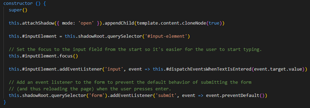
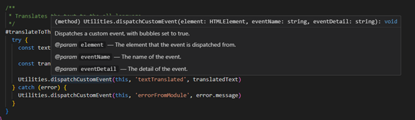

# L3 – Reflektion 

## Chapter 2 – Meaningful Names

Använda namn med intention (s. 18) och därmed kunna utläsa vad en metod gör endast genom att läsa dess namn och utan att ens titta i koden. En ambition att ständigt ha variabel- och metodnamn med intention bakom, finns i hela applikationen. Exempel på metodnamn med intention återfinns bland annat i filen input-form.js där det exempelvis går att titta på metoderna #dispatchEventsWhenTextIsEntered och #isValidString. Där är det tydligt genom metodnamnen vad metoderna gör, och därtill blir det extra tydligt att metoden #isValidString kan förväntas returnera en boolean, eftersom namnet börjar på is.

*Från input-form.js*

## Chapter 3 – Functions

Små funktioner (s 34) och som bara gör en sak (s 35) är något som Martin tydligt påpekar är önskvärt, eftersom koden då blir mer lättförståelig, översiktlig och cleaner. Även dessa riktlinjer har det funnits ambitionen om att följa i hela applikationen, och de kan exempelvis synas i några av metoderna i filen translator-app.js. Där finns metoderna #showErrorMessage, #removeTextFromTranslateButtons, och #removeTranslatedText som endast innehåller 1-3 rader kod vardera, och där varje av metoderna gör endast en uppgift, och gör denna uppgift bra. Genom att metoderna är så små blir det lätt att förstå vad de gör, och genom att de dessutom utför sin uppgift bra så blir de lättare att kalla på från andra metoder när just denna specifika uppgift behöver utföras utan några sidoeffekter.

*Från translator-app.js*

## Chapter 4 – Comments

I kapitel 4 diskuterar Robert C. Martin vikten av att använda bra kommentarer i koden. En bra kommentar bör ge en förklaring till varför utvecklaren har valt att implementera en viss lösning och vilket syfte lösningen tjänar (s. 56). Det handlar om att göra koden mer förståelig för andra utvecklare som kan komma att arbeta med den. I denna applikation har beaktan tagits till detta råd, och även om det finns väldigt få radkommentarer, så finns det inkluderat dem där det behövs. Ett exempel är constructorn i "input-form.js," där det är tillagt förklarande kommentarer för att göra koden mer lättförståelig och just förklara varför intentionen bakom utvecklarens val. Dessutom används JSDoc-kommentarer på flera ställen i koden. Anledningen till detta diskuteras närmare i avsnittet om "Formatting".

*Från input-form.js*

## Chapter 5 – Formatting

I kapitlet om formatering betonas vikten av att följa en enhetlig kodstandard inom en organisation (s. 90). I detta arbete efterföljs Linnéuniversitetets kodstandard och ESLint-konfiguration, vilket innebär att det används JSDoc för alla metoder och klasser, oavsett personliga åsikter eller rekommendationer från Clean Code. Även om denna applikation inte har utvecklats direkt i samarbete med fler personer från Linnéuniversitetet, och det ej heller har funnits ett uttalat krav på att följa denna kodstandard i detta projekt, kan det ses som lärorikt att öva på att följa teamregler. Dock finns det även tillfällen där JSDoc kan anses vara ganska användbart. Särskilt när det kommer till att enkelt kunna se exempelvis parameterbeskrivningarna när en hovrar över en metod. Detta går därtill att se som extra användbart när metoden befinner sig i en annan klass och/eller fil, såsom sker i detta exempel från the-all-language-translator.js

*Från the-all-language-translator.js*

## Chapter 6 – Objects and Data Structures

I filen input-form.js är data, det vill säga den inmatade texten, inkapslad och otillgänglig för manipulation av andra klasser. Kommunikationen med föräldrakomponenten sker endast genom att skicka anpassade händelser (custom events) beroende på användarens inmatning i textfältet. Detta följer The Law of Demeter, som diskuteras på sida 97 i Clean Code, där det betonas att komponenter och klasser som 'input-form' och 'translator-app' inte ska känna till varandras interna strukturer. Istället bör de skydda sina interna strukturer och kommunicera genom väldefinierade kanaler, såsom via custom events.

*Från input-form.js*

## Chapter 7 – Error Handling

I kapitel 7 diskuterar författaren användningen av exceptions istället för felkoder (s. 104). Denna riktlinje är implementerad i projektet genom att använda exceptions som kastas från modulen och sedan fångas upp i de relevanta translator-komponenterna i applikationen. I övrigt sker felhanteringen i applikationen genom att det dispatchas custom events. Dessa går tyvärr likt felkoder att glömma bort eller ignorera (genom att helt enkelt inte lyssna efter dem i förälder-komponenten), och de kommer då inte att hanteras. Men i just applikationsdelen av detta projekt hade det tyvärr inte varit passande att slänga errors, eftersom de hade varit svåra att kunna hantera på ett snyggt och smidigt sätt utan att applikationen hade kraschat för användaren. Den felhantering som sker nu i applikationen genom att dispatcha custom events leder nu istället till att informativa felmeddelanden kan visas för användaren, och det blir en mer användarvänlig upplevelse. Därtill är det relativt vanligt att det i web-komponent-sammanhang arbetas med en event-driven arkitetktur, vilket hade gjort det ganska annorlunda att helt plötsligt börja använda exceptions eller dylikt, vilket Martin egentligen föreslår.

*Från fig-language-translator.js*

## Chapter 8 – Boundaries

I kapitel 8 pratar författaren om att sätta tydliga gränser kring extern funktionalitet som används i koden. I denna applikation importeras funktionalitet från en extern modul från GitHub. Den funktionalitet som hämtas är från en specifik branch i detta GitHub-repo, vilket blir en avgränsning. Det kan därmed ses som att tredjeparts-kod används i applikationen. I applikationen görs det dock försök till att försöka sätta så mycket gränser runt användningen av denna externa kod som möjligt, så att inte modulen skulle kunna kontaminera eller förstöra så mycket i applikationen. Modulen används exempelvis endast på begränsade ställen; endast i en specifik funktion för översättning till det åsyftade språket importeras i varje av de olika översättar-komponenterna. Därtill är detta enda externa funktionsanrop omgett av en try-catch för att säkerställa att fel som kastas från den externa modulen inte leder till att applikationen kraschar. Dock är denna externa modul utvecklad av samma utvecklare som applikationen, så det är frågan om modulen kan räknas som tredjepartskod egentligen.

## Chapter 9 – Unit Tests

I kapitel 9 uttrycker Martin bland annat att en testfunktion endast bör ha en assert (s 130). Detta har efterföljts i majoriteten av testerna för modulen, men särskilt på ett ställe ser det aningen annorlunda ut. Det är i filen SuperStringFixer.test.js där det finns ett test som har en hel array med olika strings som testas som input efter varandra. Istället för att dela upp detta test så att det skulle bli endast ett assert per test, är det istället här ett koncept – nämligen olika exempel på försök till XSS-attacker som input – som testas i ett test, vilket Martin även föreslår som en alternativ riktlinje (s. 131). Detta tillvägagångssätt underlättar även att undvika att duplicera kod.

*Från SuperStringFixer.test.js*

## Chapter 10 – Classes

I kapitel 10 diskuteras vikten av att klasser ska vara små (s 136) och göra endast en sak – Single Responsibility Principle (SRP) (s 138). Dessa riktlinjer återföljs i projektet genom att applikationen är uppdelad i olika webbkomponenter, där varje komponent är en klass. Nedan visas en bild där alla komponenter i applikationen syns. Från namnen går det relativt väl att utröna vad komponenterna gör – det vill säga vilket ansvar de har. Komponenterna är därtill små. Eller ja, så små som de kan bli när det trots allt behövs inkluderas mycket komponent-boilerplate-kod. Inkluderat den nädvändiga boilerplate-koden som behövs för webbkomponenten samt JSDoc-kommenterar är flera av komponenterna endast runt 50 rader långa, och har endast en komponent-specifik metod.

## Chapter 11 – Systems

I kapitel 11 betonar författaren att använda standarder med eftertänksamhet och att använda dem så länge de gynnar projektet (s. 168). I denna applikation har dessa råd efterföljts genom att använda standarder för webbkomponenter, såsom att arbeta med templates, customElements, samt kommunicera med hjälp av att dispatcha custom events och sätta samt observera attribut. Dock upptäcktes det att förekomsten av att dispatcha custom events var relativt hög, och att många av dessa events dessutom hade mycket liknande uppbyggnad. För att göra koden mer DRY (Don't Repeat Yourself), skapades en Utilities-klass med en metod för att dispatcha dessa snarlika custom events. Detta medför visserligen att webbkomponenterna inte blir lika lätt återanvändningsbara, eftersom varje komponent som använder sig av denna metod blir beroende av Utilities-klassen. Dock gjordes avvägningen att denna nackdel fick stå tillbaka för att göra koden mer DRY.

*Från Utilities.js*
